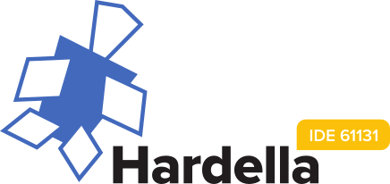

Hardella: IDE for PLC
=====================

About
-----
Hardella is an IDE for programmable logic controllers (PLC).
The main aim is to provide reasonable ST (61131-3) support (autocomplete, refactoring, etc).
The IDE is based on [JetBrains MPS](https://www.jetbrains.com/mps/) and [mbeddr](http://mbeddr.com/).

Download
--------

Just grab the latest version here: https://github.com/vlsi/ide61131/releases/latest

To update previous version, you can download "update...zip". For instance, `Hardella-update-from-143-win.zip` would update 143 or newer to the relevant release version.

Usage
-----

In order to run Hardella, Java 1.8+ is require. Grab one here: https://www.java.com/en/download

Videos
------

- Creating new project: https://youtu.be/zCULGT3yZwA
- Pointers: http://recordit.co/U6TTCkqOI4
- Arrays, structs, enums: http://recordit.co/ijjFqJuiZv
- Integration with CoDeSys: http://recordit.co/xzAv3BGlzS
- Library imports: http://recordit.co/kSuJuPbMSA
- Find usages: http://recordit.co/rx38caMeIA
- Rename variable: http://recordit.co/g1qQlwj1Co
- CFC diagram: http://recordit.co/2Itr7umnlo

Samples
-------

#### Autocomplete menu


#### Diagram editor


#### Sample ST program


```
PROGRAM PLC_PRG
  variables:
    input in : BOOL;
    output v1 : BOOL;
    input v2 : BOOL;
    superStruct : ARRAY[1..8#34] OF BOOL;
    tik : TON;
    ton : F_TRIG;
    a : WORD;
    q : COMPLEX;

  body:
    IF TON(IN := a.4, PT := T#4s).Q THEN
      v1 := TRUE + BYTE_TO_BOOL(2);
      v1 := TRUE;
      v1 := TRUE;
    END_IF;

    superStruct;
END_PROGRAM
```

License
-------

This IDE is distributed under terms of MIT license.

Development
-----------

Install mbeddr, clone ide61131, hack as required.

Changelog
---------

v1.4.0: 12 June 2016
- New project name and logo

v1.3.0: 30 April 2016
- New project wizard: https://youtu.be/zCULGT3yZwA

v1.2.0: 15 February 2016
- Simple CFC editor

v1.1.0: 14 February 2016
- Array, struct, enum: typesystem, initializers
- pointers: ADR, ^ dereference

v1.0.0
- Proof of concept release

Author
------
Vladimir Sitnikov <sitnikov.vladimir@gmail.com>